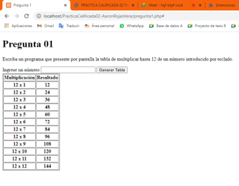
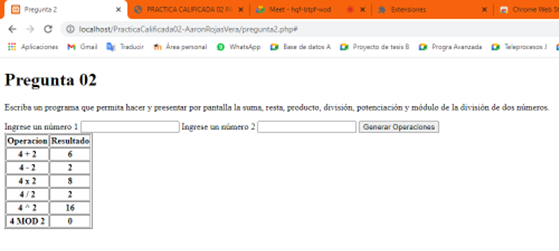
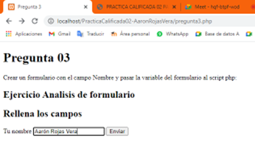
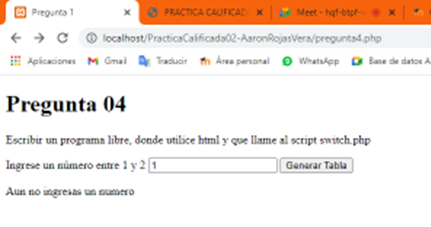
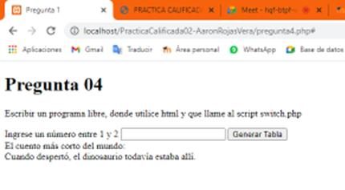
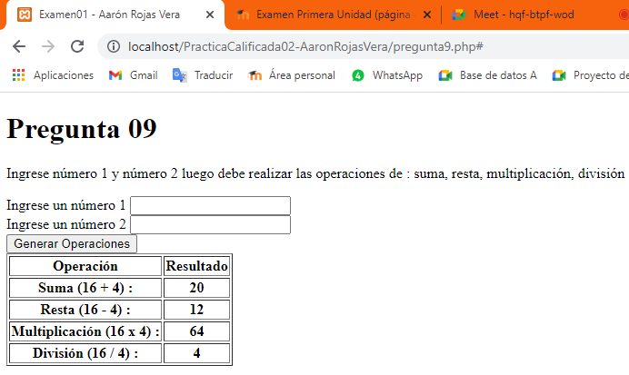

# Práctica de JS y PHP
Práctica de JS y PHP **12/04/2021**

## Pregunta 01

<strong>Imagen:</strong> Pregunta 01.

## Pregunta 02

<strong>Imagen:</strong> Pregunta 02.

## Pregunta 03

<strong>Imagen:</strong> Pregunta 03.

## Pregunta 04

<strong>Imagen:</strong> Pregunta 04.

<strong>Imagen:</strong> Pregunta 04 - Post.

## Pregunta 09

<strong>Imagen:</strong> Pregunta 09.

